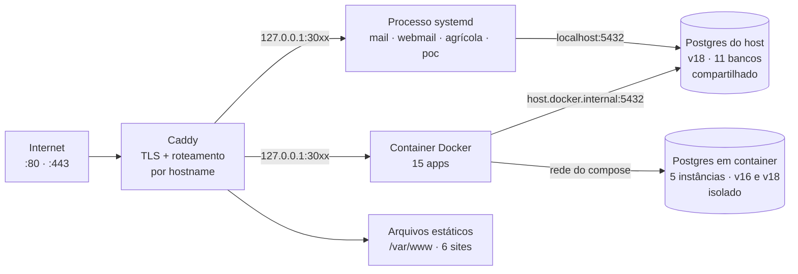
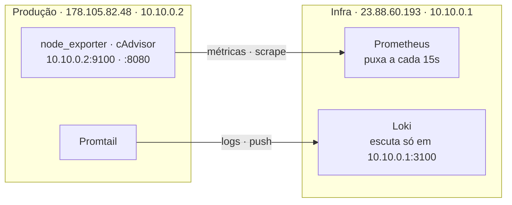

# Arquitetura Avila Ops — diagnóstico e plano

> Levantamento executado por comando nos dois VPS em **15/08/2026**.
> Cada problema traz a evidência que o comprova. **Nenhuma alteração foi aplicada** —
> este documento é o plano, não a execução.

Índice:
[Veredito](#veredito) ·
[Inventário](#1-inventário-do-ambiente) ·
[Riscos críticos](#2-riscos-críticos) ·
[Riscos altos e médios](#3-riscos-altos-e-médios) ·
[Decisões](#4-decisões-de-arquitetura) ·
[Arquitetura-alvo](#5-arquitetura-alvo) ·
[Roadmap](#6-roadmap) ·
[Aceite](#7-critérios-de-aceite) ·
[Perguntas](#9-perguntas-que-bloqueiam-decisão)

---

## Veredito

As 24 aplicações estão no ar, com TLS correto, ponto de entrada único e
observabilidade real rodando. Isso é mais maduro que a maioria das operações desse
porte. O problema não está em **como o tráfego entra** — está no que acontece
**quando algo dá errado**.

**Não existe backup fora do servidor.** Todos os dumps gravam em `/dev/sda1`, o
mesmo disco da produção. A rotina que deveria enviar ao Google Drive falha
silenciosamente todas as noites. Somado a um compartilhamento Samba com a raiz do
sistema gravável exposta à internet, o cenário de perda total não é hipotético.

Por isso este documento **inverte a ordem pedida**: não recomendo começar por
unificar bancos ou reorganizar portas. Essas são melhorias de organização, e
organização não protege contra perda de dados. As primeiras 72 horas vão para
backup, superfície de ataque e acesso — nessa ordem.

### Premissas assumidas

- **A equipe é uma pessoa.** Toda recomendação prioriza menos peças móveis sobre
  sofisticação. Kubernetes, service mesh e microsserviços estão fora de escopo —
  não por serem ruins, mas porque ninguém opera isso sozinho junto com 24 produtos.
- **O orçamento é restrito.** Onde recomendo gastar, digo quanto e por quê.
- **Odoo ainda não existe em produção.** Não encontrei instância. A decisão está
  registrada, mas o dimensionamento é estimativa.

---

## 1. Inventário do ambiente

### 1.1 Servidores

| | Produção | Infra |
|---|---|---|
| IP | `178.105.82.48` | `23.88.60.193` |
| Host | `ubuntu-4gb-nbg1-1` | — |
| CPU / RAM | 2 vCPU / 3.814 MB | 2 vCPU / 3.814 MB |
| RAM em uso | 2.063 MB | 1.658 MB |
| **Swap em uso** | **2.386 MB de 4.095** | **0 MB** |
| Disco | 38 GB, 44% usado | 38 GB, 25% usado |
| Caddy | systemd | container |
| WireGuard | `10.10.0.2` | `10.10.0.1` |
| Containers | 23 | 10 |
| Bancos | 16 | 1 |

### 1.2 Como uma requisição chega



Todo tráfego público passa por um único Caddy. **Nenhum app escuta na interface
pública** — só o Caddy, o SSH, o Samba e o servidor de e-mail. Do outro lado
existem **dois padrões de banco convivendo**.

### 1.3 Domínios servidos — produção

| Domínio | Porta | Destino | Tipo |
|---|---|---|---|
| `auth.avilaops.com` | 3060 | auth-avilaops | container |
| `app.avilaops.com` · `app.avila.inc` | 3004 | app-avila-inc-app-1 | container |
| `cliente.avilaops.com` · `cliente.avila.inc` | 3001 | cliente-avila-inc | container |
| `crm.avilaops.com` | 3020 | agenda-crm-app | container |
| `minas.avilaops.com` | 3040 | minas-espetinhos-app-1 | container |
| `irlquest.avilaops.com` | 3050 | irlquest-app-1 | container |
| `mail.avilaops.com` | 3041 / 3042 | avila-webmail / avila-mail-api | systemd |
| `agricola.avilaops.com` | 3006 | next-server | systemd |
| `api-agricola.avilaops.com` | 9002 | medusa | systemd |
| `poc.avilaops.com` | 3012 | jurisflow | systemd |
| `wa.avilaops.com` | 3004 / 9010 | app + brilhax-medusa | container |
| `saudepet.app.br` · `admin.saudepet.app.br` | 3005 | saudepet-web-1 | container |
| `cifrainssdeobras.com.br` | 3010 / 3011 | cifra-website / cifra-calculadora | container |
| `sorroche.beauty` | — | fora do Hetzner: GitHub Pages (repo `avilaops/sorroche.beauty`); era `sorroche-web` na 3030 em 15/08 | externo |
| `app.sorroche.beauty` | — | desligado em 16/09/2026 (era `sorroche-app` na 3031); restos em `/opt/arquivo/sorroche-20261006/` | desligado |
| `avilaops.com` | — | `/var/www/avila.inc` | estático |
| `docs.avilaops.com` | — | `/var/www/docs.avilaops.com` | estático |
| `jobs.avilaops.com` | — | `/var/www/jobs.avilaops.com` | estático |
| `gabrielarincao.com.br` | — | `/var/www/...` | estático |
| `maprojetos.com.br` | — | `/var/www/...` | estático |
| `seteeseteengenharia.com.br` | — | `/var/www/...` | estático |
| `avila.inc` | 301 | → `avilaops.com` | redirect |

### 1.4 Bancos — PostgreSQL 18 do host, porta 5432

| Banco | Dono | Usado por | Tamanho | Backup |
|---|---|---|---|---|
| `agricola_medusa` | agricola | Agrícola (loja) | 144 MB | ❌ |
| `pkvedacoes_medusa` | postgres | PK Vedações | 20 MB | ❌ |
| `pkvedacoes_site` | postgres | PK Vedações | 20 MB | ❌ |
| `cliente_portal` | cliente_avila | Portal do cliente | 13 MB | ✅ |
| `saudepet` | saudepet | SaúdePet | 13 MB | ✅ |
| `avila_mail` | avila_mail | Servidor de e-mail | 9,1 MB | ❌ |
| `agricola` | agricola | Agrícola (site) | 8,8 MB | ❌ |
| `sorroche_app` | sorroche_app | Sorroche (app desligado em 16/09/2026; banco mantido) | 8,7 MB | ❌ em 15/08; hoje na rotina diária |
| `jurisflow_poc` | jurisflow_poc_app | POC JurisFlow | 8,6 MB | ❌ |
| `avilaops-auth` | postgres | SSO | 7,9 MB | ❌ |
| `postgres` | postgres | padrão | 7,7 MB | n/a |

`listen_addresses = localhost,172.17.0.1` · `max_connections = 100` ·
29 conexões em uso · `ssl = on`.

### 1.5 Bancos — PostgreSQL em container

| Container | Versão | Banco | Usuário | Backup |
|---|---|---|---|---|
| `irlquest-db-1` | pg 18 | `irlquest` | irlquest | ❌ |
| `minas-espetinhos-db-1` | pg 18 | `plataforma` | — | ✅ |
| `agenda-crm-db` | pg 16 | `agenda_crm` | agenda_crm | ⚠️ quebrado |
| `cifra-cifra-db-1` | pg 16 | `cifra_calculadora` | cifra | ❌ |
| `brilhax-postgres-1` | pg 16 | `medusa_store` | medusa | ❌ |

**Cobertura real de backup: 4 de 16 bancos** — e um deles está falhando.

### 1.6 Infra — observabilidade e automação

| Serviço | Porta | Público |
|---|---|---|
| `obs.avilaops.com` → grafana | 3000 | sim |
| `n8n.avilaops.com` → n8n | 5678 | sim |
| prometheus | 9090 | não |
| loki | `10.10.0.1:3100` | só pelo túnel |
| alertmanager | 9093 | não |
| blackbox_exporter | 9115 | não |
| node_exporter | 9100 | não |
| promtail | — | não |
| `n8n-postgres-1` (banco `n8n`) | 5432 | não |

### 1.7 Fluxos entre os VPS



Os dois fluxos atravessam o mesmo túnel em **sentidos opostos**: o Prometheus
**puxa** métricas, o Promtail **empurra** logs. Por isso o Loki escuta apenas no
IP do WireGuard.

---

## 2. Riscos críticos

### 🔴 C-01 — A raiz do sistema está compartilhada por Samba, gravável, aberta para a internet

**Evidência** — `testparm -s` e `ufw status numbered`:

```
[servidor]
	path = /
	read only = No
	valid users = nicolas

[ 6] 445/tcp   ALLOW IN   Anywhere
[ 7] 139/tcp   ALLOW IN   Anywhere
```

`smbd` escuta em `0.0.0.0:445` e `0.0.0.0:139`. Exige autenticação como `nicolas`,
mas SMB exposto à internet é alvo permanente de força bruta, e aqui o prêmio é
escrita em qualquer arquivo do servidor — `/etc`, os `.env` de todas as aplicações,
as chaves do Caddy. Não há `fail2ban` para conter tentativas.

| | |
|---|---|
| **Correção** | Remover as regras ufw 6 e 7. Se o acesso é necessário, escutar apenas em `10.10.0.2` e apontar para um diretório específico, nunca `/` |
| **Validar** | `nmap -p139,445 178.105.82.48` → `filtered` |
| **Desfazer** | `ufw allow 445/tcp && ufw allow 139/tcp` |
| **Afeta** | `/etc/samba/smb.conf`, regras ufw |

### 🔴 C-02 — Não existe backup fora do servidor

**Evidência** — `/var/log/avila-rclone.log` e `rclone listremotes`:

```
2026-08-14T10:58:38+00:00 remote 'gdrive' ainda nao configurado — nada a fazer
2026-08-15T03:20:02+00:00 remote 'gdrive' ainda nao configurado — nada a fazer

NOTICE: Config file "/root/.config/rclone/rclone.conf" not found
```

O script confere o remote, não encontra, e encerra com `exit 0`. **Como termina em
sucesso, nenhum alerta dispara** — a falha é silenciosa por construção.

Os dumps que funcionam gravam em `/var/backups` e `/opt/backups`, ambos em
`/dev/sda1`. Perda do disco, corrupção ou ransomware levam produção e backup juntos.
**O RPO real hoje é: tudo.**

| | |
|---|---|
| **Correção** | Configurar o remote e validar com restauração real, não só com upload |
| **Validar** | Restaurar `cliente_portal` do Drive num banco temporário e conferir contagem de linhas |
| **Afeta** | `/root/.config/rclone/rclone.conf`, `/opt/avila-rclone/sync-drive.sh` |

### 🔴 C-03 — O backup do CRM falha toda noite desde 11/08

**Evidência** — `/var/log/agenda-crm-backup.log` e `ls -l`:

```
/bin/sh: 1: /opt/agenda-crm/current/scripts/backup-agenda-crm.sh: Permission denied

-rw-rw-rw- 1 root root 488 Aug 11 19:25 backup-agenda-crm.sh
```

Sem bit de execução, e o cron invoca direto. O arquivo também está `666` — gravável
por qualquer usuário local. Um script de backup gravável por terceiros é vetor de
execução, não só um backup quebrado.

`crm.avilaops.com` está sem cópia há quatro dias.

| | |
|---|---|
| **Correção** | `chmod 750` + dono `root:root`, executar à mão e conferir o dump |
| **Validar** | `ls -l /var/backups/agenda-crm/` mostra arquivo de hoje |

### 🔴 C-04 — O n8n não tem backup nenhum

**Evidência** — `/etc/cron.d` do VPS de infra e listagem de workflows:

```
23.88.60.193 → /etc/cron.d contém apenas: e2scrub_all

"Backup all n8n workflows to Google Drive every 4 hours"   active: false
```

O banco `n8n` guarda todos os workflows **e as credenciais** — SMTP, Google Drive,
Todoist, chave SSH. Perder esse VPS significa reconstruir sete automações à mão e
reemitir todas as credenciais.

| | |
|---|---|
| **Correção** | Ativar o workflow de backup já existente + `pg_dump` do banco `n8n` no cron |
| **Validar** | Arquivo datado de hoje no Drive |

### 🔴 C-05 — SSH aceita senha nos dois servidores, sem fail2ban

**Evidência** — `sshd -T`:

```
178.105.82.48   passwordauthentication yes   |  fail2ban: inactive
23.88.60.193    passwordauthentication yes   |  (não instalado)
```

`PermitRootLogin` está em `prohibit-password`, o que protege o root — mas qualquer
outra conta com senha fraca é porta de entrada, e nada limita tentativas. Você já
usa chave (`hetzner_avilaops`), então desligar senha não custa acesso.

| | |
|---|---|
| **Correção** | `PasswordAuthentication no` + instalar fail2ban |
| **⚠️ Cuidado** | Confirmar que a chave funciona **numa segunda sessão aberta** antes de recarregar o sshd — errar aqui perde o acesso ao servidor |
| **Validar** | `ssh -o PubkeyAuthentication=no` → `Permission denied` |

---

## 3. Riscos altos e médios

### 🟠 A-06 — O servidor está em pressão de memória

**Evidência** — `free -m` e `docker system df`:

```
RAM total=3814MB  usada=2063MB  disponível=1751MB
swap total=4095MB usada=2386MB          ← 58% do swap em uso

Build Cache   111 itens   13.4GB   (4.8GB recuperável)
```

2 vCPU e 3,8 GB sustentando 23 containers, PostgreSQL, Redis, Samba e o servidor de
e-mail. A CPU está tranquila (load 0,58 em 2 núcleos) — **o gargalo é memória**.
Swap em 58% significa que o kernel já pagina trabalho ativo: é a causa mais provável
de lentidão intermitente.

- **Alívio imediato e grátis:** `docker builder prune` devolve 4,8 GB de disco.
- **Correção real:** CPX31 (4 vCPU / 8 GB), ~€9/mês a mais. Mais barato e menos
  trabalhoso que dividir serviços num terceiro VPS.

### 🟠 A-07 — Segredos com permissão aberta

**Evidência** — `find /opt -name .env -printf "%m %u:%g %p"`:

```
666 root:root      /opt/cifra/.env          ← legível e gravável por todos
777 root:root      /opt/backups/db          ← diretório de dumps
600 deploy:deploy  /opt/cliente-avila-inc/.env    (correto)
600 root:root      /opt/auth-avilaops/.env        (correto)
```

A maioria está correta. O `/opt/cifra/.env` combina mal com C-01: escrita remota
mais segredo legível localmente formam uma cadeia completa.

### 🟠 A-08 — O SPF não autoriza o servidor que envia

**Evidência** — DNS de `avilaops.com`:

```
SPF    v=spf1 include:_spf.porkbun.com ~all     ← sem 178.105.82.48
DMARC  v=DMARC1; p=quarantine; ...
MX     fwd1.porkbun.com (10) · fwd2.porkbun.com (20)
PTR    178.105.82.48 → mail.avilaops.com          ← correto
DKIM   default._domainkey → presente               ← correto
```

PTR e DKIM já estão certos, que é a parte difícil. Falta o SPF reconhecer o IP. Com
DMARC em `quarantine`, mensagens que falham SPF e não casam o alinhamento vão para
spam.

**Cinco caminhos de envio mapeados:**

| Remetente | Caminho | Coberto pelo SPF atual |
|---|---|---|
| `avila-mail-mta` (servidor próprio) | 178.105.82.48 | ❌ |
| Portal do cliente | SMTP próprio via `mail.avilaops.com` | ❌ |
| SaúdePet | **não confirmado** | ? |
| Workflow n8n | SMTP Porkbun | ✅ |
| Encaminhamento Porkbun | `_spf.porkbun.com` | ✅ |

Registro proposto — **só aplicar após confirmar o SaúdePet**:

```
v=spf1 ip4:178.105.82.48 include:_spf.porkbun.com ~all
```

### 🟠 A-09 — A documentação do servidor de e-mail está atrás da realidade

**Evidência** — `ss -lntp` vs README do projeto:

```
*:25  *:465  *:587  *:110  *:143  *:993  *:995   ← todos escutando

README de mail.avilaops.com:  "IMAP — Fase 3"    ← diz que não existe
```

IMAP e POP3 estão no ar, incluindo as portas em texto claro (110 e 143). Se o
STARTTLS não for obrigatório nelas, senhas de caixa trafegam legíveis.

**não confirmado** — validar com
`openssl s_client -connect mail.avilaops.com:143 -starttls imap` e testar se login
sem TLS é aceito.

### 🟡 M-10 — O Caddyfile de produção não está em nenhum repositório

22 domínios em `/etc/caddy/Caddyfile`, sem versão, sem histórico, sem revisão. É o
arquivo de maior alcance do ambiente: um erro nele derruba tudo de uma vez.

### 🟡 M-11 — O cron de backup aponta para o diretório antigo do portal

**Evidência** — `crontab -l`:

```
0 3 * * * /bin/bash /opt/cliente-avila-inc/backup.sh
*/5 * * * * /bin/bash /opt/cliente-avila-inc/health_check.sh
```

O deploy pelo GitHub Actions já aponta para `/opt/cliente-avilaops-com`. Quando a
pasta for renomeada, **estas duas linhas quebram** — e o backup do portal para de
rodar em silêncio, como o do CRM. **Renomear e ajustar o cron precisam ser a mesma
tarefa.**

### 🟡 M-12 — A faixa de portas 30xx está saturando

Quinze portas ocupadas entre 3001 e 3060, alocadas manualmente, sem registro. Já
causou conflito real: o `auth.avilaops.com` foi para 3060 porque 3010 pertence ao
`cifrainssdeobras.com.br`.

### 🟡 M-13 — Possível resíduo de ERPNext e regras conflitantes no Caddy

A configuração do Samba referencia `/home/frappe/frappe-bench`, sugerindo instalação
de ERPNext/Frappe. **não confirmado** — validar com `ls /home/frappe` e
`systemctl list-units | grep frappe`. Se existir e não estiver em uso, é consumo de
memória e superfície à toa num servidor já em swap.

> **Correção (15/08/2026):** eu havia relatado que `wa.avilaops.com` tinha três
> regras conflitantes no Caddy. **Isso estava errado.** O bloco real tem duas
> linhas:
>
> ```caddy
> wa.avilaops.com {
> 	reverse_proxy 127.0.0.1:3004
> }
> ```
>
> O achado veio de um `awk` meu que arrastava o nome do host entre blocos, então
> regras de blocos seguintes apareciam atribuídas ao `wa`. Não há nada a corrigir
> nesse domínio.

---

## 4. Decisões de arquitetura

### 4.1 Padrão de banco de dados

| Opção | A favor | Contra |
|---|---|---|
| Tudo no Postgres do host | Um backup, um monitor, menos memória | Versão presa ao SO; upgrade do Ubuntu vira upgrade de banco |
| Um Postgres por aplicação | Isolamento total, versões independentes | ~80 MB de RAM cada; 16 rotinas de backup; inviável com 3,8 GB |
| **Uma instância em container, database + role por app** ✅ | Versão desacoplada do SO, um backup, um pool, caminho natural para réplica | Falha única para todos; exige migração planejada |

**Recomendo a terceira**, com ressalva de sequência: **não migre agora**. Hoje o
risco não é o formato dos bancos, é a ausência de cópia. Migrar sem backup testado é
trocar um problema organizacional por risco de perda. Primeiro backup confiável,
depois unificação.

### 4.2 Portas e descoberta de serviços

| Opção | A favor | Contra |
|---|---|---|
| Continuar alocando 30xx à mão | Zero trabalho | Já colidiu uma vez; colide de novo |
| Caddy em container numa rede Docker compartilhada | Acaba com portas no host; proxy por nome de container | Mover o único ponto de entrada de 22 domínios com os certificados — risco alto sem homologação |
| **Caddy segue no host + registro de portas versionado** ✅ | Resolve a colisão hoje, risco quase nulo | Não elimina a alocação manual |

A segunda é tecnicamente superior e é o destino certo — mas não com um operador só e
sem homologação. **Recomendo a terceira agora** e a segunda depois que existir
homologação (fase de 90 dias), quando der para ensaiar a troca.

### 4.3 Ambientes

Não existe homologação: todo deploy vai direto para produção. O VPS de infra tem
folga real — 25% de disco, 1,6 GB de 3,8 GB de RAM, **swap zerado**.

**Recomendo usar o VPS de infra como homologação**, em vez de contratar um terceiro.
Custo zero, e o WireGuard já existe. A contrapartida é observabilidade e homologação
dividirem máquina — aceitável enquanto homologação for intermitente.

### 4.4 Multi-tenant

O SaúdePet já resolveu bem: `tenant_id` em todas as tabelas, `AuthIdentity` com
unicidade por `(tenant_id, provider, provider_user_id)`. **Esse é o padrão a
replicar** — está provado no próprio ecossistema e não depende de recurso exótico.

- `tenant_id` por linha para produtos SaaS (SaúdePet, Minas, portal do cliente).
- Banco separado só onde houver exigência contratual de isolamento, ou para o Odoo,
  que já tem multiempresa nativo.
- **Mello Transportes**, sendo independente e de cliente único, **não precisa de
  multi-tenant** — adicionar seria custo sem benefício.

### 4.5 Identidade e permissões

O `auth.avilaops.com` já está no ar e resolve autenticação. O que ele não resolve é
autorização fina: o papel é binário (`ADMIN` / `CLIENTE`), derivado do domínio do
e-mail.

Isso basta por enquanto e eu não complicaria antes da necessidade aparecer. Quando
aparecer — provavelmente com o Odoo e com equipes de cliente — o caminho é
acrescentar papel **por aplicação** no próprio auth, com `scope` por app no token.
**Não recomendo adotar um servidor de identidade de mercado**: é mais peça móvel do
que o problema pede.

---

## 5. Arquitetura-alvo

A arquitetura recomendada **não é uma reconstrução**. O desenho atual está correto
para o porte. O alvo é o mesmo desenho com as lacunas fechadas:

| Camada | Hoje | Alvo |
|---|---|---|
| Entrada | Caddy no host, config fora de versão | Caddy no host, **Caddyfile versionado em git**, aplicado por script |
| Aplicações | Docker, systemd e estáticos misturados | Docker como padrão; systemd só onde exige porta baixa (MTA) |
| Portas | 30xx manual, sem registro | Registro versionado; faixa por família de produto |
| Bancos | Host (11) + containers (5), v16 e v18 | Uma instância em container, database + role por app |
| Backup | 4 de 16, só local, sem alerta | **16 de 16, cifrado, fora do servidor, com restauração testada** |
| Ambientes | Só produção | Homologação no VPS de infra |
| Segredos | `.env` no disco, um em 666 | `.env` em 600, dono `deploy`, injetados pelo CI |
| Observabilidade | Métricas e logs, sem alerta de backup | Alerta para **job que não rodou**, não só para serviço fora |

### Padrões a fixar

- **APIs** — prefixo `/api/v1` em todos os serviços novos. O SaúdePet já usa; o
  portal e o auth não. Padronizar na próxima alteração de cada um, sem quebrar o que
  está no ar.
- **Rastreio** — cabeçalho `X-Request-Id` gerado no Caddy e propagado; logs em JSON
  com esse campo. Sem isso, correlacionar um erro entre Caddy, app e banco é
  adivinhação.
- **Jobs** — o n8n é o agendador oficial (já substituiu o cron de SEO). Todo job novo
  nasce lá, com *error workflow* ligado. `cron.d` fica só para o que é do sistema
  operacional (backup, rotação).
- **Idempotência** — todo webhook que muda estado precisa de chave idempotente. O
  webhook do Stripe já mostrou por quê: reenvio após falha pulava o bloco inteiro por
  causa do `status` já gravado.
- **Diretórios** — `/opt/<dominio-com-hifens>`, sem exceção. Hoje há
  `/opt/cliente-avila-inc`, `/opt/agenda-crm` e `/opt/cifra` seguindo três convenções.

---

## 6. Roadmap

Ordenado por **risco removido**, não por facilidade.

### 72 horas — parar de sangrar

1. **Fechar o Samba na internet** — remover regras ufw 445 e 139. *Depende de
   confirmar se o acesso é usado.*
2. **Configurar o remote do rclone** e rodar o primeiro envio manual.
3. **Corrigir o backup do CRM** — `chmod 750`, dono root, executar à mão e conferir.
4. **Ligar o backup do n8n** — ativar o workflow já existente.
5. **Desligar senha no SSH** + fail2ban, validando a chave numa segunda sessão antes
   de aplicar.
6. `docker builder prune` — devolve 4,8 GB.
7. `chmod 600 /opt/cifra/.env` e `chmod 750 /opt/backups/db`.

### 7 dias — cobrir e provar

1. **Backup dos 16 bancos** num script único dirigido por manifesto, cobrindo host e
   containers, com cifragem.
2. **Restaurar de verdade** um banco a partir do Drive num destino temporário.
   Backup sem restauração testada é suposição.
3. **Alerta de job que não rodou** no Alertmanager — foi exatamente o que faltou para
   o CRM falhar quatro dias sem ninguém notar.
4. **Versionar o Caddyfile** de produção.
5. **Renomear o portal** para `/opt/cliente-avilaops-com` *junto com* as duas linhas
   de cron.
6. **Corrigir o SPF**, após confirmar o remetente do SaúdePet.

### 30 dias — organizar

1. **Upgrade para CPX31** (4 vCPU / 8 GB) — tira o servidor do swap.
2. **Homologação no VPS de infra**, com deploy pelo mesmo GitHub Actions.
3. **Registro de portas e domínios** versionado, como fonte da verdade.
4. **Limpar resíduo** — regras do `wa.avilaops.com`, Frappe, IMAP/POP se não usados.
5. **Padronizar health check** em `/health` e ligar ao blackbox exporter.

### 90 dias — consolidar

1. **Unificar os bancos** na instância em container — com backup provado,
   homologação disponível e janela definida.
2. **Caddy em container** na rede compartilhada, ensaiado em homologação primeiro.
3. **Odoo**, se confirmado — dimensionar à parte: sozinho pede 2 GB e banco dedicado.
4. **Réplica de leitura** do PostgreSQL no VPS de infra pelo túnel, virando backup
   quente.

---

## 7. Critérios de aceite

| Item | Aceite — verificável por comando |
|---|---|
| Samba fechado | `nmap -p139,445 178.105.82.48` → `filtered` |
| Backup fora do servidor | `rclone ls gdrive:backups` mostra dump de hoje |
| Restauração provada | `pg_restore` em banco temporário + contagem confere com produção |
| Cobertura de backup | 16 arquivos datados de hoje, um por banco |
| Alerta de job | desligar um backup de propósito → alerta chega em ≤24 h |
| SSH endurecido | `ssh -o PubkeyAuthentication=no` → `Permission denied` |
| Memória saudável | `free -m` → swap usada < 10% por 7 dias |
| SPF correto | envio de teste ao Gmail → `SPF pass` e `DMARC pass` |
| Caddy versionado | `diff` entre repositório e `/etc/caddy/Caddyfile` vazio |

---

## 8. Dependências entre tarefas

- **Unificar bancos** exige backup provado **e** homologação. Duas fases antes — não
  antecipar.
- **Renomear o portal** exige ajustar cron **e** derrubar o container antigo antes de
  puxar o código novo, senão colide na porta 3001.
- **Corrigir o SPF** exige confirmar o remetente do SaúdePet, senão o e-mail dele
  passa a falhar.
- **Caddy em container** exige homologação e registro de portas prontos.
- **Desligar senha no SSH** exige validar a chave numa segunda sessão aberta — errar
  aqui perde o acesso ao servidor.

---

## 9. Perguntas que bloqueiam decisão

1. **O Samba é usado?** Se você monta o servidor como unidade de rede no Windows,
   fecho a porta pública e o deixo apenas no WireGuard — você continua acessando pelo
   túnel. Se é resíduo, removo o pacote.
2. **O SaúdePet envia e-mail por qual caminho?** É o último remetente a mapear, e sem
   ele não dá para mexer no SPF com segurança.
3. **Existe ERPNext/Frappe rodando?** A config do Samba cita
   `/home/frappe/frappe-bench`. Se estiver instalado e parado, é memória e superfície
   à toa num servidor já em swap.
4. **€9/mês pelo upgrade do servidor está aprovado?** É a correção mais barata para a
   pressão de memória.

---

*Diagnóstico executado em 15/08/2026. Nenhuma alteração aplicada.*
