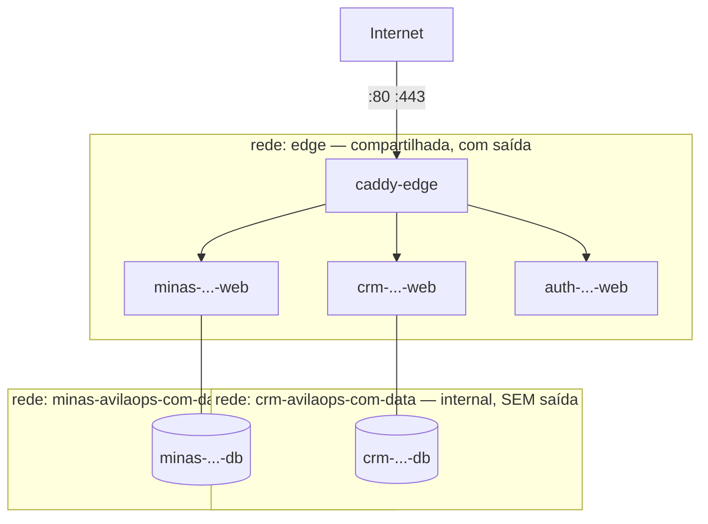

# Norma de Plataforma AvilaOps

> O projeto se adequa ao servidor. Não o contrário.
>
> Este documento é o contrato: um projeto que não o cumpre não sobe. A verificação
> é automática (`scripts/norma-check.sh`), então "adequar-se" é objetivo, não
> negociado caso a caso.

---

## 0. Antes de tudo: o que NÃO vamos fazer

Você pediu "microserviços". **Não recomendo, e é uma recomendação forte.**

Microserviços resolvem um problema organizacional: várias equipes precisando
entregar em ritmos diferentes sem pisar umas nas outras. Esse problema não existe
aqui — a equipe é uma pessoa. O que eles cobram em troca é caro e imediato:
comunicação em rede entre partes que poderiam ser uma chamada de função,
observabilidade distribuída, versionamento de contratos, e falhas parciais que
viram madrugada de depuração.

Com 24 produtos e um operador, adotar microserviços piora exatamente os três
objetivos que você listou: eficiência, segurança e facilidade de manutenção.

O que você realmente pediu — **gerenciamento eficiente, segurança, manutenção
fácil, nomenclatura padronizada** — se resolve com *contrato de implantação
padronizado*. É isso que este documento define. Cada produto continua sendo um
serviço só, bem-comportado, previsível e verificável.

---

## 1. Nomenclatura — tudo deriva do domínio

Uma regra, sem exceção: **o domínio é a fonte do nome de todo o resto.** Não há
espaço para criatividade, e é isso que torna tudo previsível e programável.

Para `crm.avilaops.com`, o slug é `crm-avilaops-com`:

| Recurso | Padrão | Exemplo |
|---|---|---|
| Diretório | `/opt/<slug>` | `/opt/crm-avilaops-com` |
| Projeto compose | `<slug>` | `crm-avilaops-com` |
| Container web | `<slug>-web` | `crm-avilaops-com-web` |
| Container worker | `<slug>-worker` | `crm-avilaops-com-worker` |
| Container banco | `<slug>-db` | `crm-avilaops-com-db` |
| Rede privada | `<slug>-data` | `crm-avilaops-com-data` |
| Volume | `<slug>-<proposito>` | `crm-avilaops-com-pgdata` |
| Banco de dados | `<slug com _>` | `crm_avilaops_com` |
| Role do banco | igual ao banco | `crm_avilaops_com` |
| Arquivo de ambiente | `/opt/<slug>/.env` | modo `600`, dono `deploy:deploy` |

**Por que isso importa mais do que parece:** hoje existem `/opt/cliente-avila-inc`,
`/opt/agenda-crm` e `/opt/cifra` — três convenções para a mesma coisa. Um script
de backup, de deploy ou de inventário precisa de uma lista escrita à mão para
saber o que existe. Com a regra acima, a lista é derivável, e o que não segue o
padrão aparece sozinho na verificação.

---

## 2. Redes — três níveis de confiança

Hoje há 14 redes bridge, todas `<projeto>_default`, sem separação de papel. Todo
container — inclusive os PostgreSQL — está numa rede com saída para a internet.

O padrão passa a ser:



### `edge` — compartilhada

Rede externa, criada uma vez. Só entram: o Caddy e os containers que respondem
HTTP. **Banco nunca entra na `edge`.**

```bash
docker network create --subnet 172.31.0.0/24 --gateway 172.31.0.1 edge
```

> **A sub-rede é fixa de propósito.** Deixando o Docker escolher, a `edge` nasceu
> em `192.168.0.0/20` — fora da faixa `172.16.0.0/12` que o ufw libera para o
> PostgreSQL do host (`5432 ALLOW IN 172.16.0.0/12`). Qualquer container na `edge`
> seria bloqueado ao acessar o banco, com erro de conexão que não aponta para o
> firewall. Fixar em `172.31.0.0/24` mantém a regra de ufw válida e torna a rede
> reproduzível numa reinstalação.

### `<slug>-data` — privada, `internal: true`

Uma por projeto. Liga a aplicação ao seu banco, Redis ou fila.

`internal: true` é o ponto central: containers nessa rede **não têm rota para a
internet**. Um PostgreSQL comprometido não consegue baixar ferramenta nem
exfiltrar dado para fora. Hoje isso é possível em todos os cinco bancos em
container.

### Portas no host: só o Caddy

Nenhum projeto publica porta. `expose:` em vez de `ports:`. O Caddy alcança pelo
nome do container na rede `edge`.

Isso elimina de vez o problema da faixa 30xx — que já custou um conflito real
quando o `auth` precisou ir para 3060 porque o CIFRA ocupava a 3010.

**Exceção única:** o MTA (`avila-mail-mta`), que precisa das portas 25, 465, 587,
143, 993, 110 e 995 na interface pública por definição do protocolo.

---

## 3. Labels — o inventário deixa de ser lista escrita à mão

Todo container declara quem é:

```yaml
labels:
  avilaops.domain: crm.avilaops.com
  avilaops.stack: crm
  avilaops.tier: web          # web | worker | data
  avilaops.backup: "postgres:crm_avilaops_com"   # ou "false"
  avilaops.owner: nicolas
```

Isso não é documentação — é o que faz os scripts funcionarem sozinhos:

```bash
# inventário, sem lista fixa
docker ps --filter label=avilaops.tier=web \
  --format '{{.Label "avilaops.domain"}}\t{{.Names}}'

# backup dirigido por label, não por lista hardcoded
docker ps --filter label=avilaops.backup --format '{{.Names}}'
```

**O problema que isso resolve estruturalmente:** hoje o backup cobre os bancos que
alguém lembrou de listar. Foi assim que 11 de 16 ficaram sem cópia e o CRM passou
quatro dias quebrado sem ninguém ver. Com label, um banco novo sem
`avilaops.backup` é **detectado pela verificação** — o esquecimento vira erro
visível, não silêncio.

---

## 4. Contrato de compose

Todo `docker-compose.yml` do portfólio segue esta forma:

```yaml
name: crm-avilaops-com

services:
  web:
    build: .
    container_name: crm-avilaops-com-web
    restart: unless-stopped
    env_file: [.env]
    expose: ["3000"]              # nunca "ports"
    networks: [edge, data]
    labels:
      avilaops.domain: crm.avilaops.com
      avilaops.stack: crm
      avilaops.tier: web
      avilaops.backup: "false"
      avilaops.owner: nicolas
    healthcheck:
      test: ["CMD", "wget", "-qO-", "http://localhost:3000/health"]
      interval: 30s
      timeout: 5s
      retries: 3
      start_period: 20s
    depends_on:
      db: { condition: service_healthy }

  db:
    image: postgres:18-alpine
    container_name: crm-avilaops-com-db
    restart: unless-stopped
    environment:
      POSTGRES_DB: crm_avilaops_com
      POSTGRES_USER: crm_avilaops_com
      POSTGRES_PASSWORD_FILE: /run/secrets/db_password
    volumes: [crm-avilaops-com-pgdata:/var/lib/postgresql/data]
    networks: [data]              # SÓ data — nunca edge
    labels:
      avilaops.domain: crm.avilaops.com
      avilaops.stack: crm
      avilaops.tier: data
      avilaops.backup: "postgres:crm_avilaops_com"
      avilaops.owner: nicolas
    healthcheck:
      test: ["CMD-SHELL", "pg_isready -U crm_avilaops_com"]
      interval: 10s
      retries: 5

networks:
  edge:
    external: true
  data:
    name: crm-avilaops-com-data
    internal: true                # sem rota para a internet

volumes:
  crm-avilaops-com-pgdata:
    name: crm-avilaops-com-pgdata

secrets:
  db_password:
    file: ./secrets/db_password
```

### Regras obrigatórias

1. `name:` igual ao slug do domínio.
2. `container_name` explícito, seguindo `<slug>-<papel>`.
3. `expose:`, nunca `ports:` (só o Caddy publica).
4. Banco **só** na rede `data`.
5. `data` com `internal: true`.
6. Os cinco labels `avilaops.*` em todo serviço.
7. `healthcheck` em todo serviço de longa duração.
8. `restart: unless-stopped`.
9. Segredo em `.env` (modo 600) ou `secrets:` — nunca literal no compose.

---

## 5. Caddy no container — o que destrava tudo

Proxy por nome de container exige o Caddy **dentro** da rede `edge`. Hoje ele roda
em systemd no host, e é justamente por isso que cada app precisa publicar uma
porta.

O bloco de site deixa de citar porta do host:

```caddy
# antes — porta do host, alocada à mão, com risco de colisão
crm.avilaops.com {
	reverse_proxy 127.0.0.1:3020
}

# depois — nome do container, sem porta no host
crm.avilaops.com {
	reverse_proxy crm-avilaops-com-web:3000
}
```

### Migração com risco controlado

O Caddy é o ponto único de entrada de 22 domínios e guarda os certificados. A
troca precisa de ensaio, não de coragem.

1. Preparar homologação no VPS de infra e ensaiar a troca inteira lá.
2. Copiar o acervo de certificados (`/var/lib/caddy/.local/share/caddy`, 948 KB)
   para o volume do container — assim ele sobe já com os certificados válidos e
   não pede nada ao Let's Encrypt, evitando limite de emissão.
3. Manter o Caddyfile idêntico na primeira subida, ainda apontando para
   `127.0.0.1:<porta>` — a mudança é só *onde o Caddy roda*.
4. Trocar os upstreams para nome de container **um domínio por vez**, começando
   por um de baixo tráfego.
5. `systemctl disable caddy` só depois que o container estiver estável por alguns
   dias.

**Rollback em qualquer ponto:** `docker compose down` no caddy-edge e
`systemctl start caddy`. Os certificados continuam no host, intactos.

---

## 6. Verificação automática

Sem verificação, norma é intenção. `scripts/norma-check.sh` audita todos os
containers e aponta quem está fora:

```bash
./scripts/norma-check.sh            # relatório
./scripts/norma-check.sh --strict   # sai != 0 se houver violação (para CI)
```

Checa: labels obrigatórios presentes · portas publicadas fora do Caddy · banco
exposto na `edge` · redes `data` sem `internal: true` · containers sem healthcheck
· nomes fora do padrão · bancos sem `avilaops.backup`.

---

## 7. Ordem de adoção

Nada disso vale um "big bang" com 23 containers.

| Fase | O que | Critério de saída |
|---|---|---|
| 1 | Criar a rede `edge`, escrever o `norma-check.sh`, rodar e medir o tamanho do buraco | Relatório com a lista de violações por projeto |
| 2 | **Piloto num serviço só** — `auth-avilaops-com`, que é novo, pequeno, sem tráfego crítico e sem banco em container | Piloto 100% conforme; `norma-check` limpo para ele |
| 3 | Caddy em container, em homologação, com o Caddyfile atual | Ensaio bem-sucedido, com rollback testado |
| 4 | Caddy em container em produção, upstreams ainda por porta | 22 domínios respondendo, certificados preservados |
| 5 | Converter em lote, por família: cifra → sorroche → minas → crm → agrícola | `norma-check --strict` passando |
| 6 | Remover as portas 30xx e o registro manual | `ss -lntp` sem nada em 30xx |

**O piloto vem antes do lote de propósito.** Converter 23 serviços com um padrão
que ainda não foi provado em nenhum multiplica o erro por 23.

---

## 8. Padrões de dados

A mesma lógica de nomenclatura vale dentro do banco:

- Um database por produto, com role de mesmo nome — sem `postgres` como dono.
- Nome do banco = slug com `_`: `crm_avilaops_com`.
- Todo produto multi-tenant carrega `tenant_id` em **toda** tabela de negócio,
  com unicidade sempre incluindo o `tenant_id`. O SaúdePet já faz assim
  (`@@unique([tenant_id, provider, provider_user_id])`) — é o modelo a copiar.
- Migração versionada em arquivo, nunca alteração manual em produção.
- Timestamps em UTC, com nome `criado_em` / `atualizado_em`.

---

## 9. O que muda na prática

| Hoje | Com a norma |
|---|---|
| 14 redes `*_default`, todas com saída | `edge` + uma `data` sem saída por projeto |
| Todo banco alcança a internet | Banco isolado, sem rota externa |
| 15 portas alocadas à mão na faixa 30xx | Zero portas de app no host |
| Inventário por lista escrita à mão | Derivado de labels |
| Backup por lista fixa — 4 de 16 | Dirigido por label; faltante vira erro |
| Três convenções de diretório | Uma, derivada do domínio |
| "Funciona no meu projeto" | `norma-check --strict` no CI |

---

*Norma escrita em 15/08/2026. Ainda não aplicada — ver ordem de adoção na §7.*
